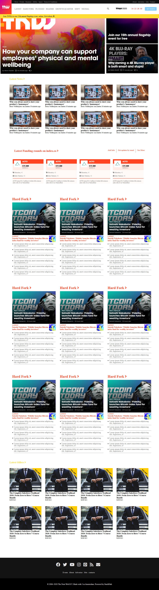

# TNW-clone

First CSS project of Lidya Ghebreigziabher and Nick Kuria

Additional description about the project and its features.

This is a project to demonstrate the existing knowledge of HTML and CSS. It is a collaborative project which recreates a responsive clone of the next web website.

<i>Built With HTML5, CSS3, GIT, and VSCODE</i>

Live Demo : [The-livedemo-link](https://sad-davinci-ec8c48.netlify.app/)

<h1>Getting Started</h1>

To get a local copy up and running follow these simple example steps.

Prerequisites Text editor,Github profile and Git.

<h2>Authors</h2>

👤 Author1

Github: @Lidya1234 Linkedin: [Lidya-github-link](https://www.linkedin.com/in/lidya-ghebreigziabher-4a94391aa/)

👤 Author2

Github: @Nkuria Linkedin: [Nick-github-link](https://www.linkedin.com/in/nick-kuria-a148931a9/)

🤝 Contributing Contributions, issues and feature requests are welcome!

Feel free to check the issues page.

Show your support Give a ⭐️ if you like this project!

Acknowledgments Hat tip to anyone whose code was used Inspiration etc

📝 License This project is a collaboration project of microverse students. All rights are reserved for Lidya and Nick.